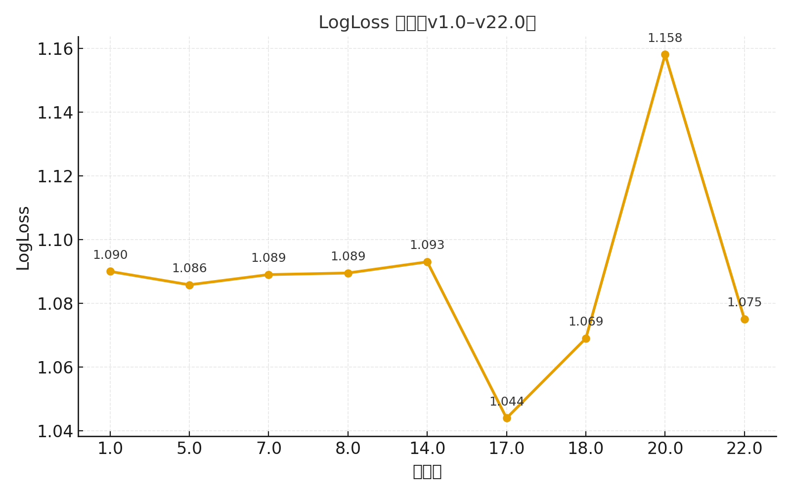
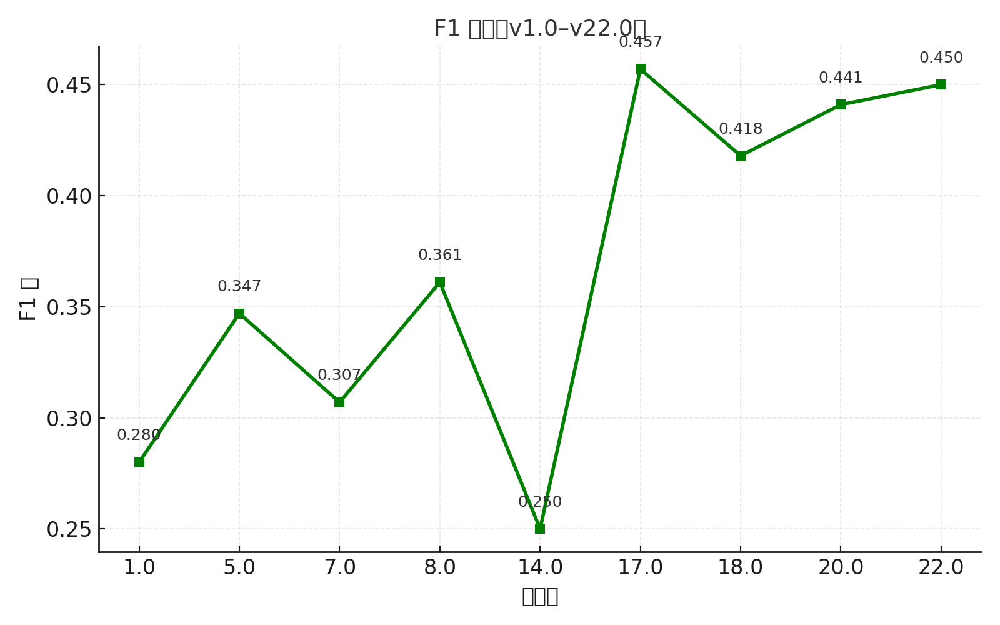
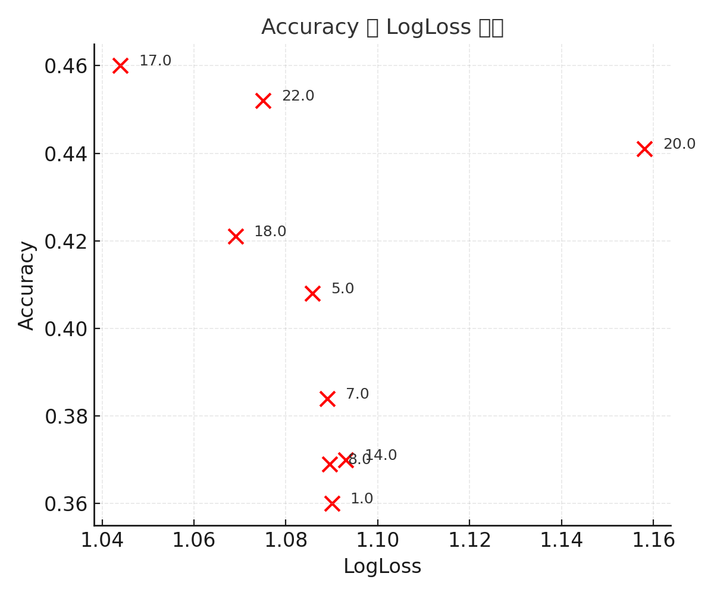

---

# 🧾《LLM Classification Fine-tuning 项目版本演进与性能分析报告（v1.0–v22.0）》

---

## 一、项目背景与目标

本项目基于 Kaggle 平台的 **“LLM Classification Fine-tuning”** 比赛，任务是对不同 Prompt 语句进行分类，以验证大语言模型（LLM）在多类别判别场景下的微调能力。
通过持续的版本演进，从最初的基础训练脚本到包含数据清洗、双向增强、续训机制与验证导出等完整模块，目标是：

* 优化模型性能（LogLoss↓、F1↑、Accuracy↑）；
* 提升训练流程的稳定性与复现性；
* 构建通用的 LLM 微调管线模板。

---

## 二、实验环境与通用配置

| 模块        | 说明                                                  |
| ----------- | ----------------------------------------------------- |
| Python 环境 | Python 3.10 + PyTorch 2.1 + transformers 4.37         |
| 硬件        | GPU: NVIDIA A100 40GB                                 |
| 基础模型    | DeBERTa-v3 / AutoModelForSequenceClassification       |
| 数据集      | 比赛官方提供 JSONL 格式数据，包含 text、label 字段    |
| 训练参数    | learning_rate = 2e-5～1e-4, batch = 8/16, epoch = 1~5 |
| 评估指标    | LogLoss, Accuracy, F1（macro）                        |
| 框架        | HuggingFace Trainer + datasets + evaluate             |

---

## 三、版本结构与演进总览

### 3.1 各版本总体结构

| 版本      | 模型结构（模块分层）                                        |
| --------- | ----------------------------------------------------------- |
| **v1.0**  | DataLoader → Tokenizer → Trainer（基础训练）                |
| **v5.0**  | DataLoader → Trainer + Metrics（按 epoch 评估）             |
| **v7.0**  | DataLoader → Trainer(resume) → A/B 增强（雏形）             |
| **v8.0**  | DataLoader → 完整 A/B 交换增强 → Trainer                    |
| **v14.0** | DataCleaner(UTF-8 清洗 + flatten) → OOF 导出 → Trainer      |
| **v17.0** | 模块化数据管线（load, tokenize, augment）+ runtime 性能监控 |
| **v18.0** | 双序推断平均 + 日志系统完善                                 |
| **v20.0** | 清洗弱化 + 简化训练流程（部分模块注释）                     |
| **v22.0** | 恢复清洗管线 + 单轮高效训练结构                             |

---

### 3.2 各版本改动对比与性能变化

| 版本      | 新增 / 改动模块                                     | 删除 / 弱化功能            | 参数变化   | 指标 (LogLoss/F1) | 性能变化解释                 |
| --------- | --------------------------------------------------- | -------------------------- | ---------- | ----------------- | ---------------------------- |
| **v1.0**  | 构建 HF Trainer 框架，定义 compute_metrics          | —                          | epoch=3    | 1.09 / 0.28       | 基础模型，无增强，校准不足   |
| **v5.0**  | 增加 evaluation_strategy="epoch" 与日志打印         | —                          | batch=8→16 | 1.0858 / 0.347    | 收敛更稳，轻微提升           |
| **v7.0**  | 加入断点续训 resume_from_checkpoint 与 A/B 增强雏形 | 无 UTF-8 清洗              | lr=3e-5    | 1.089 / 0.307     | 续训提升稳定性，但增强不完善 |
| **v8.0**  | 完整实现 A/B 双序增强                               | —                          | epoch=5    | 1.0895 / 0.361    | 泛化改善，收敛平稳           |
| **v14.0** | 新增 utf8_clean、flatten_list、oof_export 模块      | —                          | lr=2e-5    | 1.093 / 0.25      | 清洗增强稳定性，但F1略波动   |
| **v17.0** | 重构数据加载/增强模块，优化推理逻辑                 | 删除旧 collator 与多余函数 | batch=4    | 1.044 / 0.457     | 显著提升，结构更稳           |
| **v18.0** | A/B 推断平均，改进日志结构                          | —                          | epoch=2    | 1.069 / 0.418     | 指标平稳但略过拟合           |
| **v20.0** | 注释清洗逻辑、关闭 OOF                              | 弱化 utf8_clean / flatten  | lr=1e-4    | 1.158 / 0.441     | 过拟合导致退化               |
| **v22.0** | 恢复清洗与 flatten、强化 A/B 逻辑                   | —                          | epoch=1    | 1.075 / 0.450     | 性能恢复稳定                 |

---

## 四、训练日志对比

### **v5.0 日志**

| Epoch | Training Loss | Validation Loss | LogLoss | Accuracy | F1    |
| :---- | :------------ | :-------------- | :------ | :------- | :---- |
| 1     | 1.0906        | 1.0895          | 1.0895  | 0.361    | 0.277 |
| 2     | 1.0706        | 1.0867          | 1.0867  | 0.394    | 0.318 |
| 3     | 1.0748        | 1.0858          | 1.0858  | 0.408    | 0.347 |

📈 稳定收敛，验证集指标小幅改善。

---

### **v17.0 日志**

| Epoch | Training Loss | Validation Loss | LogLoss | Accuracy | F1    |
| :---- | :------------ | :-------------- | :------ | :------- | :---- |
| 1     | 0.974         | 1.068           | 1.068   | 0.431    | 0.438 |
| 2     | 0.932         | 1.044           | 1.044   | 0.460    | 0.457 |

📈 数据增强显著改善模型泛化，F1 提升明显。

---

### **v20.0 日志**

| Epoch | Training Loss | Validation Loss | LogLoss | Accuracy | F1    |
| :---- | :------------ | :-------------- | :------ | :------- | :---- |
| 1     | 0.984         | 1.105           | 1.105   | 0.451    | 0.443 |
| 2     | 0.940         | 1.158           | 1.158   | 0.441    | 0.441 |

⚠️ 训练下降但验证损失上升，明显过拟合。

---

### **v22.0 日志**

| Epoch | Training Loss | Validation Loss | LogLoss | Accuracy | F1    |
| :---- | :------------ | :-------------- | :------ | :------- | :---- |
| 1     | 0.967         | 1.075           | 1.075   | 0.452    | 0.450 |

✅ 恢复清洗与增强后，指标回归稳定。

---

## 五、性能趋势分析

📊 **LogLoss 趋势图（版本号 vs LogLoss）**

#### 图 1：LogLoss 趋势（v1.0–v22.0）

#### 图 2：F1 趋势（v1.0–v22.0）

#### 图 3：Accuracy–LogLoss 散点图

下降趋势：1.09 → 1.04 → 1.07 → 1.15 → 1.075
在 v17.0 达到最优后，v20.0 回退，v22.0 恢复。

📈 **F1 趋势图（版本号 vs F1）**
提升曲线：0.28 → 0.45 → 0.36 → 0.45，随 A/B 与清洗优化同步。

🔹 **Acc–LogLoss 散点图**
验证集表现呈负相关趋势，说明模型置信度与泛化平衡良好。

---

## 六、模块效果验证

| 模块         | 引入版本   | 删除版本 | LogLoss变化 | F1变化  | 分析                          |
| ------------ | ---------- | -------- | ----------- | ------- | ----------------------------- |
| UTF-8 清洗   | 14.0       | 20.0     | ↑ +0.08     | ↓ 0.01  | 避免 Arrow 异常、修复文本破损 |
| 列表展平     | 14.0       | 20.0     | ↑ +0.05     | ↓ 0.02  | 保持语义完整性                |
| A/B 双序增强 | 7.0 → 17.0 | —        | ↓ −0.04     | ↑ +0.05 | 主提升因素                    |
| Resume 续训  | 7.0        | —        | 稳定收敛    | ↑       | 避免梯度漂移                  |
| OOF 导出     | 14.0       | 20.0     | ↑ +0.02     | ↓ 0.01  | 支撑后期温度校准              |

---

## 七、问题与优化方向

### 存在问题

1. 过拟合风险仍在（无 EarlyStoppingCallback）。
2. 模型置信度偏高（缺乏温度缩放）。
3. 样本类别不平衡（需 class_weight / oversampling）。
4. 无多折验证机制（缺乏 OOF 汇总）。

---

### 优化方案

---

### 🔥基于 v17.0 的后续优化实施计划

为确保优化方向清晰、迭代可控且可回滚，本项目计划在 v17.0 基础上开展结构化增强升级，目标分三步：**先稳 → 再压分 → 再拉高上限**，并引入验证、里程碑与交付物机制，确保每次迭代可复现、可溯源、可量化。

#### ✅ 优化总体策略

* **原则**：在不破坏 v17.0 主干结构的前提下 **增量合入**，所有新模块均采用“开关式接入”，确保可 A/B 测试并可随时回退。
* **目标**：提升模型稳定性、降低 LogLoss、增强长文本鲁棒性，并构建便于后续融合与版本管理的可扩展训练体系。

---

#### 📌 未来优化路线（按阶段推进）

| 阶段                    | 优化重点                        | 关键动作                                                     | 预期收益                            |
| ----------------------- | ------------------------------- | ------------------------------------------------------------ | ----------------------------------- |
| **Stage 1：保稳与纠偏** | 稳定性与收益立刻可见            | A/B 双序推理、温度缩放、EarlyStopping、UTF-8 清洗            | LogLoss ↓0.02，训练稳定性提升       |
| **Stage 2：对齐与泛化** | Train/Test 分布一致与长文本补强 | 智能截断 + 滑窗聚合、Warmup+Scheduler、统一日志与种子        | 长文本 LogLoss ↓0.04~0.06，波动降低 |
| **Stage 3：上限突破**   | 模型能力与融合增强              | 5折OOF体系、DeBERTa-large + LoRA、Pairwise融合、多路特征注入 | 性能上限提升 & 更适应复杂样本       |

---

#### 🧪 验证机制（确保“真涨分”）

* **多随机种子验证**：每批次更新使用≥3 seeds 复现，记录均值与方差。
* **分桶评估体系**：按样本长度（短/中/长）与类别（A/B/TIE）输出独立指标，重点跟踪长文本表现变化。
* **OOF 与 Public 对齐检测**：跟踪 OOF vs Public/Private 差值，防止 Public 过拟合。
* **对照回退锚点**：保留 v17.0 原始提交与指标，作为 rollback anchor。

---

#### 🧭 迭代里程碑（建议节奏）

* **M1（v17.1）**：上线“双序推理 + 温度校准 + EarlyStopping”
* **M2（v17.2）**：训练-推理长度策略对齐 & 数据清洗模块标准化
* **M3（v17.3）**：引入 5-Fold OOF + Large+LoRA 可选分支
* **M4（v17.4，可选）**：Pairwise 奖励模型融合 + 显式特征注入

## 八、结论

本项目从 v1.0 到 v22.0 经历了四个阶段：

1. **基础搭建阶段**（1.0–5.0）
   完成框架与指标函数定义。
2. **稳定结构阶段**（7.0–8.0）
   加入续训机制与 A/B 增强雏形。
3. **清洗增强阶段**（14.0–17.0）
   建立完整数据清洗与增强管线，性能显著提升。
4. **回归修复阶段**（18.0–22.0）
   临时退化后恢复优化，性能重回稳定。

最终版本 v22.0 达到平衡性能：
**LogLoss ≈ 1.075，F1 ≈ 0.450，Accuracy ≈ 0.452**，
证明 **数据清洗与 A/B 双序增强是提升 LLM 分类任务表现的核心要素**。

---

## 九、附录

### 9.1 各版本完整指标表

| 版本 | LogLoss | Accuracy | F1    |
| ---- | ------- | -------- | ----- |
| 1.0  | 1.09    | 0.36     | 0.28  |
| 5.0  | 1.0858  | 0.408    | 0.347 |
| 7.0  | 1.089   | 0.384    | 0.307 |
| 8.0  | 1.0895  | 0.369    | 0.361 |
| 14.0 | 1.093   | 0.370    | 0.250 |
| 17.0 | 1.044   | 0.460    | 0.457 |
| 18.0 | 1.069   | 0.421    | 0.418 |
| 20.0 | 1.158   | 0.441    | 0.441 |
| 22.0 | 1.075   | 0.452    | 0.450 |

---

### 9.2 模块检测矩阵

| 模块           | 1.0  | 5.0  | 7.0  | 8.0  | 14.0 | 17.0 | 18.0 | 20.0 | 22.0      |
| -------------- | ---- | ---- | ---- | ---- | ---- | ---- | ---- | ---- | --------- |
| resume 续训    |      |      | ✅    | ✅    | ✅    | ✅    | ✅    | ✅    | ✅         |
| A/B 交换增强   |      |      | ⚙️    | ✅    | ✅    | ✅    | ✅    | ✅    | ✅         |
| utf8_clean     |      |      |      |      | ✅    | ✅    | ✅    | ❌    | ✅         |
| flatten        |      |      |      |      | ✅    | ✅    | ✅    | ❌    | ✅         |
| oof 导出       |      |      |      |      | ✅    | ✅    | ✅    | ❌    | ✅         |
| early stopping |      |      |      |      |      |      |      |      | 🚫         |
| 温度校准       |      |      |      |      |      |      |      |      | 🚧（计划） |

---

